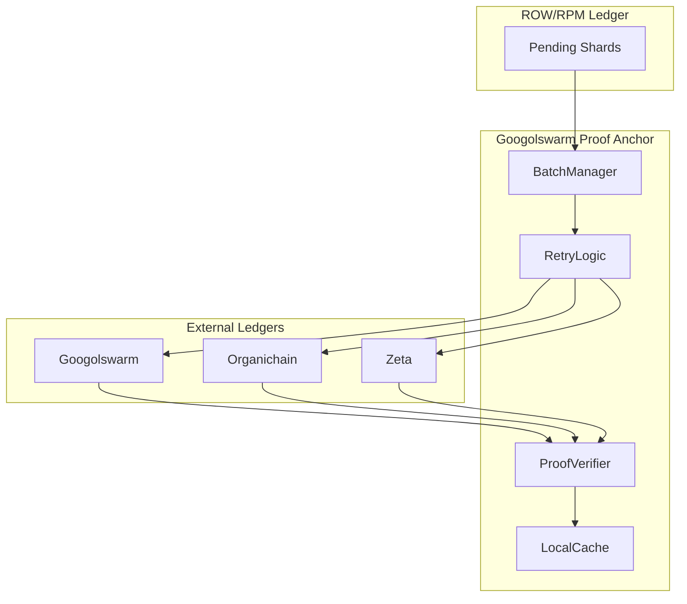

# Googolswarm Proof Anchor Architecture

## Overview

`googolswarm-proof-anchor` is the **Anchoring Layer** of the Sovereign Spine, providing immutable proof submission to Googolswarm/Organichain with offline-first queueing.

## Architecture Diagram

Key Design Principles
Offline-First - Queue-based anchoring with reconnection logic
Bulk Efficiency - Batch submission to reduce overhead
Retry Resilience - Exponential backoff for failures
Local Verification - Cache enables offline proof verification
Multi-Ledger - Redundant anchoring for censorship resistance
Security Properties
Cryptographic Receipts - Every anchor returns verifiable proof
Queue Integrity - Pending queue is hex-stamp attested
Retry Security - No duplicate submissions on retry
Cache Security - Local cache is encrypted at rest
Batch Processing

[table-dfa5d142-908e-42dd-9dc1-5baf5eac83a7 (1).csv](https://github.com/user-attachments/files/25729277/table-dfa5d142-908e-42dd-9dc1-5baf5eac83a7.1.csv)
Stage,Description
Queue,Shards added to pending queue
Batch,Batches created from queue (max 1000)
Submit,Batches submitted to ledgers
Verify,Receipts verified cryptographically
Cache,Verified proofs stored locally

Document Hex-Stamp: 0x6f7a8b9c0d1e2f3a4b5c6d7e8f9a0b1c2d3e4f5a6b7c8d9e0f1a2b3c4d5e6f7a
Last Updated: 2026-03-04
